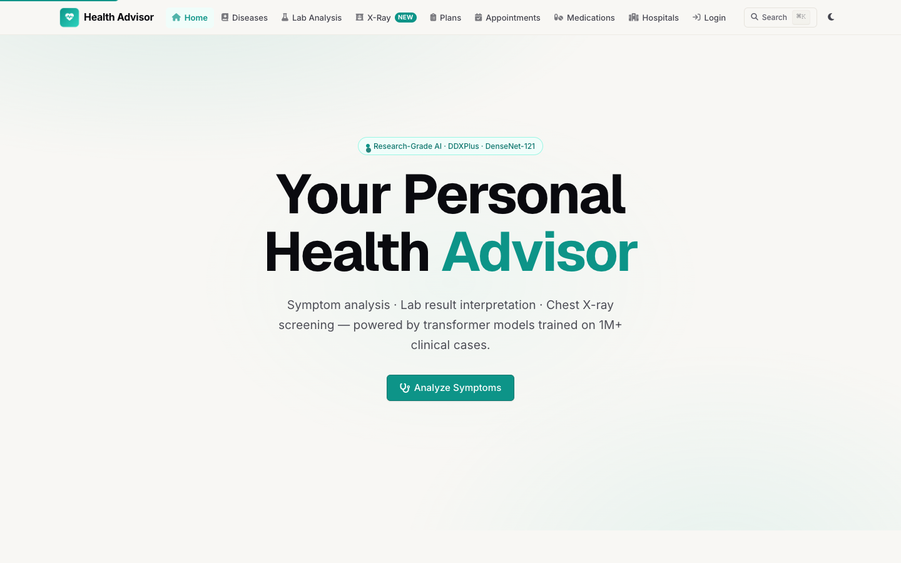
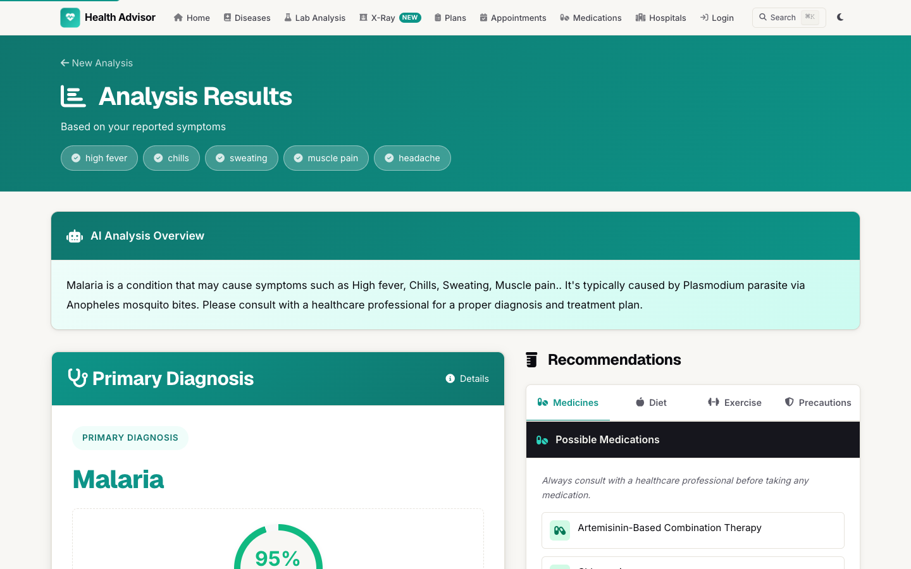
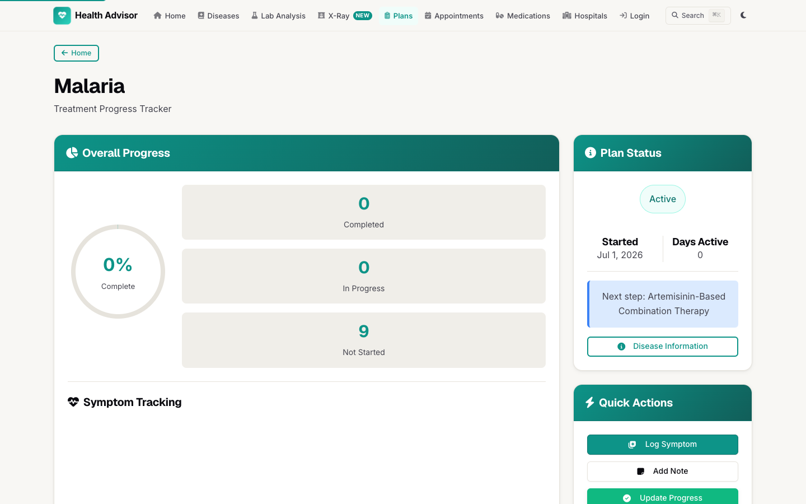
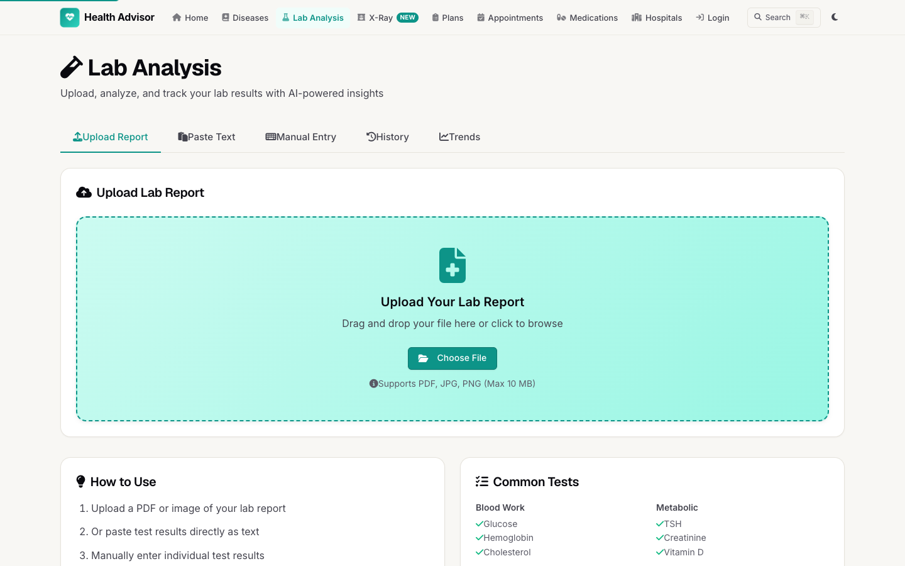
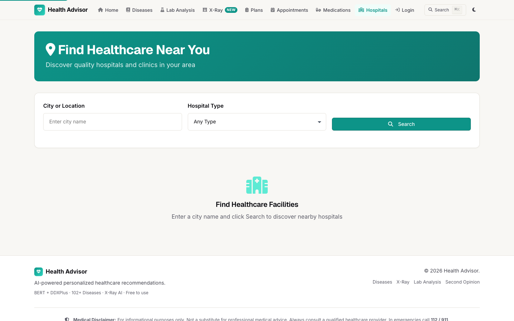

# Health Advisor — AI-Powered Healthcare Recommendation System

[](https://github.com/harshaldonarkar/healthcare-recommendation-system/actions/workflows/tests.yml)

> A personalized healthcare recommendation system built with BERT, Flask, and multi-provider LLM integration. Predicts diseases from natural language symptoms, generates actionable treatment plans, analyzes lab reports, and connects patients with relevant specialists.

**Live demo:** coming soon &nbsp;|&nbsp; Demo credentials (once deployed, and for local runs): `demo` / `demo123`

---

## Results

Trained and evaluated on the [DDxPlus](https://arxiv.org/abs/2205.09148) dataset (1.03M clinical cases, 49 diseases, 134,529 held-out test cases). Full methodology and significance testing in [`docs/paper.md`](docs/paper.md).

| Model | Acc@1 | Macro-F1 | NDCG@3 | Mean KL ↓ |
|---|---|---|---|---|
| TF-IDF + Logistic Regression (baseline) | 99.51% | 0.994 | 0.748 | 6.288 |
| **DistilBERT + KL divergence (ours)** | **98.51%** | **0.984** | **0.921** | **0.416** |

The KL-divergence training objective trades ~1% top-1 accuracy for a **15× reduction in calibration error** and a large NDCG@3 gain — the model doesn't just get the top guess right more often, it ranks the correct diagnosis higher across the full differential. See [Disease Prediction Pipeline](#disease-prediction-pipeline) for how this feeds the live app.

---

## Table of Contents

- [Overview](#overview)
- [Results](#results)
- [Features](#features)
- [Tech Stack](#tech-stack)
- [Project Structure](#project-structure)
- [Setup Instructions](#setup-instructions)
- [Environment Variables](#environment-variables)
- [Running the App](#running-the-app)
- [Running Tests](#running-tests)
- [Training the Model](#training-the-model)
- [Database Setup](#database-setup)
- [Architecture](#architecture)
- [Disease Prediction Pipeline](#disease-prediction-pipeline)
- [API Reference](#api-reference)
- [Screenshots](#screenshots)
- [Disclaimer](#disclaimer)

---

## Overview

Health Advisor is a full-stack AI healthcare assistant that helps users identify potential diseases based on their symptoms, understand their condition, and follow a structured treatment plan. It combines a fine-tuned BERT model, Support Vector Classifier (SVC), and optional LLM enhancement to deliver accurate, explainable results across 102 diseases.

Built as a college capstone project demonstrating applied machine learning, web development, and healthcare AI.

---

## Features

### Core
- **AI Disease Prediction** — Ensemble of BERT + SVC + direct symptom matching across 102 diseases
- **Chest X-Ray Analysis** — DenseNet-121 (torchxrayvision) screens 14 pathologies with Grad-CAM heatmaps
- **DDxPlus Differential Diagnosis** — DistilBERT trained with KL divergence on 150k clinical cases (49 diseases)
- **LLM Enhancement** — Optional AI-generated explanations via OpenAI, Groq, Anthropic, HuggingFace, or Ollama
- **Symptom Autocomplete** — Real-time suggestions from the medical knowledge base
- **Demo Mode** — One-click demos for Malaria, Acne, and Diabetes
- **Second Opinion** — Compare BERT model output vs. LLM clinical assessment side-by-side

### Treatment & Tracking
- **Treatment Plans** — Auto-generated step-by-step plans (medications, diet, exercise, precautions)
- **Treatment Tracker** — Track progress per step with status updates, circular progress ring, and Chart.js symptom trends
- **Symptom Logger** — Log daily symptom severity (1–10 scale) with notes
- **Treatment Notes** — Attach personal notes to any active plan

### Lab Analysis
- **Lab Report Upload** — Upload PDF or image lab reports
- **OCR + Parsing** — Extracts test values using PyMuPDF and Tesseract fallback
- **Result Interpretation** — Color-coded normal / warning / abnormal with reference ranges
- **History Tracking** — Stores past lab results per user

### Doctor & Hospital Search
- **City-Based Search** — Find hospitals and doctors by city
- **Disease-Specific Recommendations** — Specialists matched to predicted disease
- **Hospital Reviews** — View and submit patient reviews with star ratings
- **Drug Interactions** — Check multiple medications for known interactions

### User Management & Security
- **Authentication** — Sign up / log in with session management
- **Access Control** — Treatment plans are bound to the server session; other users get 403
- **CSRF Protection** — All state-changing form/AJAX requests require a CSRF token
- **My Treatment Plans** — Dashboard of all active and completed plans
- **Appointment Booking** — Schedule, view, and cancel appointments
- **Medication Schedules** — Set medication reminders and track adherence

### UI/UX
- **Modern Design** — Premium custom CSS design system (no Bootstrap), Geist + Inter type, warm off-white palette with a single teal accent
- **Glassmorphic Navbar** — Sticky, blurred, with animated heartbeat logo
- **Dark Mode** — Full dark theme toggled via button, persisted in localStorage
- **Fully Responsive** — Mobile-first CSS Grid layout, hamburger menu on mobile
- **Questionnaire Mode** — 5-step adaptive symptom questionnaire
- **Interactive Analyzer** — Chat-based AI symptom conversation with typing indicator

---

## Tech Stack

| Layer | Technology |
|---|---|
| **ML Models** | BERT (`bert-base-uncased` fine-tuned), SVC (`scikit-learn`), DistilBERT + KL divergence (DDxPlus), DenseNet-121 (`torchxrayvision`) |
| **Backend** | Python 3.12, Flask 2.3, Flask-CORS |
| **LLM Providers** | OpenAI, Groq, Anthropic, HuggingFace, Ollama |
| **Database** | PostgreSQL (psycopg2), JSON fallback |
| **Frontend** | Custom CSS (no Bootstrap), Jinja2, Font Awesome 6, Chart.js |
| **OCR / PDF** | PyMuPDF, Tesseract, pdf2image, Pillow |
| **ML Libraries** | PyTorch 2.6, Transformers 4.49, NumPy, Pandas |
| **Testing** | pytest |
| **Reporting** | ReportLab (PDF export) |

---

## Project Structure

```
healthcare-recommender/
├── data/
│   ├── medical_data_complete.csv      # 102 diseases with symptoms, medicines, diets
│   ├── doctors_database.json          # Hospital and doctor records
│   ├── progress_data.json             # Runtime treatment plan data (JSON fallback)
│   └── medication_reminders.json      # Medication schedule data
│
├── models/
│   ├── fine_tuned_model/              # Fine-tuned BERT
│   │   ├── model.safetensors
│   │   ├── config.json
│   │   ├── label_map.json             # 102-class label map
│   │   └── vocab.txt / tokenizer files
│   └── svc.pkl                        # SVC backup model
│
├── src/
│   ├── backend/
│   │   ├── app.py                     # Flask app entry point (blueprint registration)
│   │   ├── core.py                    # Shared state: models, LLMs, helpers, caching
│   │   ├── db.py                      # PostgreSQL access layer with graceful fallback
│   │   ├── blueprints/
│   │   │   ├── auth.py                # /login, /signup, /logout
│   │   │   ├── diagnosis.py           # /, /analyze, /predict-enhanced, /disease-dashboard
│   │   │   ├── treatment.py           # Treatment plan CRUD + progress tracking
│   │   │   ├── lab.py                 # Lab report upload & OCR analysis
│   │   │   ├── doctors.py             # Doctor/hospital search + city API
│   │   │   ├── medication.py          # Medication schedules & adherence
│   │   │   ├── appointments.py        # Appointment booking & management
│   │   │   └── imaging.py             # Chest X-ray analysis + Grad-CAM API
│   │   ├── llm_integration.py         # General LLM: HuggingFace, Ollama, OpenAI, Groq
│   │   ├── medical_llm_integration.py # Medical LLM: BiomedNLP, OpenAI, Anthropic
│   │   ├── symptom_questionnaire.py   # 5-step adaptive questionnaire engine
│   │   ├── progress_tracker.py        # Treatment plan tracking (DB + fallback)
│   │   ├── medication_reminder.py     # Medication schedule management
│   │   ├── lab_analysis.py            # PDF/OCR lab result parser (PathlabAnalyzer)
│   │   ├── doctor_search.py           # City-based hospital/doctor search
│   │   ├── symptom_analysis.py        # Symptom correlation & differential diagnosis
│   │   ├── xray_analysis.py           # DenseNet-121 X-ray pathology detection
│   │   ├── report_generator.py        # PDF report generation (ReportLab)
│   │   ├── email_service.py           # Email notification service
│   │   ├── security_log.py            # Structured security event logging
│   │   └── utils.py                   # Shared helper functions
│   │
│   ├── frontend/
│   │   ├── templates/                 # 20 Jinja2 HTML templates
│   │   │   ├── index.html             # Home — hero + symptom input
│   │   │   ├── login.html             # Login (split-screen design)
│   │   │   ├── signup.html            # Register (split-screen design)
│   │   │   ├── results.html           # AI diagnosis results
│   │   │   ├── disease_dashboard.html # Disease detail + timeline
│   │   │   ├── diseases_list.html     # Disease encyclopedia with search
│   │   │   ├── my_treatment_plans.html
│   │   │   ├── treatment_tracker.html # Step tracker + charts + logs
│   │   │   ├── lab_analysis.html      # Lab report upload + results
│   │   │   ├── interactive_analyzer.html # Chat-based analyzer
│   │   │   ├── questionnaire.html     # 5-step questionnaire
│   │   │   ├── doctor_search.html     # Hospital search
│   │   │   ├── appointments.html
│   │   │   ├── new_appointment.html
│   │   │   ├── drug_interactions.html
│   │   │   ├── hospital_recommendations.html
│   │   │   ├── hospital_reviews.html
│   │   │   ├── doctor_recommendations.html
│   │   │   ├── second_opinion.html
│   │   │   └── symptom_trends.html
│   │   └── static/
│   │       ├── css/style.css          # Custom design system (2,560+ lines, no Bootstrap)
│   │       └── js/
│   │           ├── questionnaire.js   # Adaptive questionnaire logic
│   │           └── lab-analysis.js    # File upload & result rendering
│   │
│   ├── database/
│   │   ├── schema.sql                 # PostgreSQL schema
│   │   ├── import_data.py             # Load disease CSV into DB
│   │   └── import_doctors.py          # Load doctor JSON into DB
│   │
│   └── training/
│       └── training_model.py          # BERT fine-tuning script
│
├── scripts/                           # DDxPlus research pipeline (download →
│                                      # prepare → train → evaluate → paper)
├── docs/                              # Research paper, results tables, figures
│
├── tests/
│   ├── test_prediction.py
│   ├── test_auth.py
│   ├── test_lab_analysis.py
│   ├── test_doctor_search.py
│   ├── test_medication_reminder.py
│   ├── test_progress_tracker.py
│   └── test_utils.py
│
├── requirements.txt
├── CLAUDE.md
└── README.md
```

---

## Setup Instructions

### 1. Clone and create virtual environment

```bash
git clone https://github.com/yourusername/healthcare-recommender.git
cd healthcare-recommender

# Python 3.12 recommended
python -m venv venv

# Activate
# macOS/Linux:
source venv/bin/activate
# Windows:
venv\Scripts\activate
```

### 2. Install dependencies

```bash
pip install -r requirements.txt
```

### 3. Configure environment variables

```bash
cp .env.example .env
# Edit .env with your keys (see Environment Variables section below)
```

### 4. (Optional) Set up PostgreSQL

The app runs without a database using in-memory/JSON fallback. For full persistence:

```bash
# Create database
psql -U postgres -c "CREATE DATABASE healthcare_system;"

# Apply schema
psql -U postgres -d healthcare_system -f src/database/schema.sql

# Import disease data
cd src/database
python import_data.py

# Import doctor data
python import_doctors.py
```

---

## Environment Variables

Copy `.env.example` to `.env` and fill in the values you need:

```env
# LLM Provider (choose one: huggingface, ollama, openai, groq, anthropic)
LLM_PROVIDER=groq

# HuggingFace
HF_API_KEY=your_hf_api_key
HF_MODEL=mistralai/Mistral-7B-Instruct-v0.1

# OpenAI
OPENAI_API_KEY=your_openai_key
OPENAI_MODEL=gpt-3.5-turbo

# Groq (fast & free tier available)
GROQ_API_KEY=your_groq_key
GROQ_MODEL=mixtral-8x7b-32768

# Anthropic
ANTHROPIC_API_KEY=your_anthropic_key
ANTHROPIC_MODEL=claude-3-haiku-20240307

# Ollama (self-hosted)
OLLAMA_URL=http://localhost:11434/api/generate
OLLAMA_MODEL=mistral

# PostgreSQL (optional — app runs without it)
DB_NAME=healthcare_system
DB_USER=postgres
DB_PASSWORD=your_password
DB_HOST=localhost
DB_PORT=5432

# Flask
SECRET_KEY=your_secret_key_here
FLASK_DEBUG=0   # set to 1 only for local development
```

> **Tip:** The app works without any LLM keys — disease prediction still runs via BERT + SVC. LLM keys enable richer explanations on the results page.

---

## Running the App

```bash
# Must be run from the backend directory (bare imports depend on it)
source venv/bin/activate
cd src/backend
python app.py
```

Open `http://localhost:5001` in your browser (override the port with the `PORT` env var).

> Debug mode is off by default. Set `FLASK_DEBUG=1` for auto-reload during development —
> never in anything publicly reachable (the Werkzeug debugger allows code execution).

**Demo credentials** (built-in, no database required):
- Username: `demo` / Password: `demo123`

---

## Running Tests

```bash
# Run all tests from project root
PYTHONPATH=src/backend python -m pytest tests/ -v

# Run a specific test file
PYTHONPATH=src/backend python -m pytest tests/test_prediction.py -v

# Run a single test
PYTHONPATH=src/backend python -m pytest tests/test_lab_analysis.py::TestParseLabResults::test_glucose_parsed -v
```

**Test coverage:** 98 tests across prediction, auth, lab analysis, doctor search, medication reminders, progress tracking, and utilities. The suite also runs in CI (GitHub Actions) on every push.

---

## Training the Model

The BERT model is already fine-tuned and included in `models/fine_tuned_model/`. To retrain:

```bash
cd src/training
python training_model.py
```

- Base model: `bert-base-uncased`
- Dataset: `data/medical_data_complete.csv` (102 diseases)
- Output: `models/fine_tuned_model/` and `results/checkpoint-*/`
- Training time: ~30–60 min on GPU, longer on CPU

---

## Architecture

The system is built as a **Flask app with blueprints** on three layers:

### Layer 1 — Shared Core (`core.py`)
All shared state lives here — imported by every blueprint. Contains:
- Global instances: `medical_data` (DataFrame), `llm`, `medical_llm`, `progress_tracker`, `medication_reminder`, `lab_analyzer`, `questionnaire`, `symptom_analyzer`, `doctor_search`
- `get_model()` — thread-safe lazy loader for BERT with double-check lock
- Prediction functions: `predict_disease_with_confidence()`, `predict_with_svc()`, `direct_symptom_matching()`
- LRU-cached helpers: `get_disease_info()`, `get_recommendations()`, `get_disease_list_cached()`
- `validate_symptoms()` — input sanitization and length validation

### Layer 2 — Blueprint Layer (`blueprints/`)

| Blueprint | Key Routes |
|---|---|
| `auth.py` | `/login`, `/logout`, `/signup`, `/my-treatment-plans` |
| `diagnosis.py` | `/`, `/analyze`, `/predict-enhanced`, `/diseases*`, `/disease-dashboard*`, `/questionnaire/*`, `/interactive-analyzer` |
| `treatment.py` | `/create-treatment-plan`, `/treatment-plan/*`, `/treatment-tracker/*` |
| `lab.py` | `/lab-analysis/*` |
| `doctors.py` | `/doctors/*`, `/api/doctors/*`, `/api/doctors/cities` |
| `medication.py` | `/medication-schedule/*` |
| `appointments.py` | `/appointments`, `/appointments/new` |

### Layer 3 — LLM Integration (dual-class design)

| Class | File | Purpose | Providers |
|---|---|---|---|
| `LLMIntegration` | `llm_integration.py` | General enhancement, explanations | HuggingFace, Ollama, OpenAI, Groq |
| `MedicalLLMIntegration` | `medical_llm_integration.py` | Medical-specific analysis | BiomedNLP, OpenAI, Anthropic |

---

## Disease Prediction Pipeline

```
User symptoms (natural language)
  │
  ▼
Input sanitized (HTML stripped, max 2,000 chars, validate_symptoms())
  │
  ▼
Malaria fast-path check (keyword match → 95% confidence if all 4 keywords present)
  │
  ▼
┌─────────────────────────────────────────────────┐
│  Ensemble Prediction                            │
│  ├── BERT (fine-tuned, softmax probabilities)   │
│  ├── SVC (scikit-learn, models/svc.pkl)         │
│  └── Direct symptom matching (word overlap)     │
│  → Best prediction selected by confidence       │
└─────────────────────────────────────────────────┘
  │
  ▼
LLM Enhancement (optional, provider-configurable)
  │
  ▼
Recommendations lookup from medical_data_complete.csv
  │
  ▼
Rendered via Jinja2 templates (results.html)
```

---

## API Reference

Treatment-plan routes are session-protected: requests for another user's data return `403`.

| Method | Endpoint | Description |
|---|---|---|
| `POST` | `/analyze` | Submit symptoms, get disease prediction |
| `GET` | `/api/symptoms` | List known symptoms (autocomplete, cached) |
| `GET` | `/diseases` | List all 102 diseases (cached) |
| `GET` | `/disease/<name>` | Disease info: symptoms, medicines, precautions |
| `GET` | `/doctors/search` | Search hospitals by city |
| `GET` | `/api/doctors/cities` | List all available cities |
| `GET` | `/doctors/recommend/<disease>` | Specialist recommendations for a disease |
| `POST` | `/lab-analysis/upload` | Upload and analyze a lab report (PDF/image) |
| `POST` | `/lab-analysis/manual-entry` | Analyze manually entered lab values |
| `POST` | `/api/xray/analyze` | Analyze a chest X-ray (14 pathologies) |
| `POST` | `/api/xray/gradcam` | Grad-CAM heatmap for an X-ray finding |
| `POST` | `/create-treatment-plan` | Create a plan (identity from session) |
| `GET` | `/treatment-plan/<uid>/<pid>` | Get treatment plan data |
| `PUT` | `/treatment-plan/<uid>/<pid>/step/<sid>` | Update a treatment step status |
| `POST` | `/treatment-plan/<uid>/<pid>/symptom` | Log a symptom |
| `POST` | `/treatment-plan/<uid>/<pid>/note` | Add a note to a plan |
| `GET` | `/treatment-plan/<uid>/<pid>/report.pdf` | Download PDF health report |
| `POST` | `/api/drug-interactions` | Check interactions between drugs |

---

## Screenshots

**Homepage** — Hero section with gradient, glassmorphic symptom search card, stats bar


**Results** — Circular confidence gauge, AI explanation, tabbed recommendations


**Treatment Tracker** — Circular progress ring, step-by-step cards, quick actions


**Lab Analysis** — Drag-and-drop dropzone for PDF/image lab report upload


**Doctor Search** — City-based hospital search with type filtering


---

## Disclaimer

> **This application is a college project for educational purposes only.** It is not a substitute for professional medical advice, diagnosis, or treatment. Always consult a qualified healthcare provider for any health concerns. Never disregard professional medical advice because of something this application suggests.

---

## License

MIT License — see [LICENSE](LICENSE) for details.

---

*Built with Python, Flask, BERT, and a lot of caffeine. ☕*
